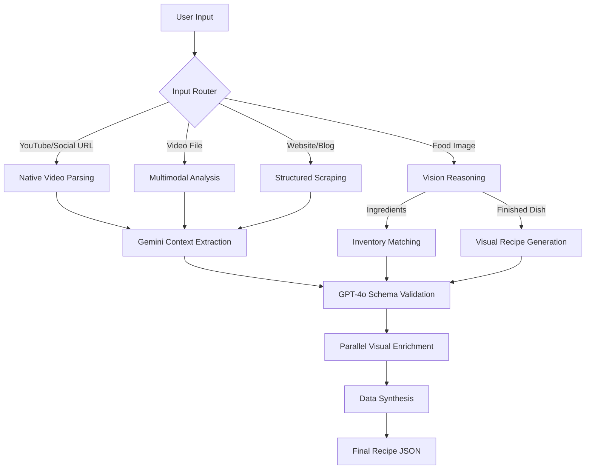

# PlateIt AI Agent 🧠

The **PlateIt AI Agent** is the core intelligence layer of the application. Powering the "Better Agent" workflow, it uses **LangGraph** to manage stateful, multi-step culinary tasks—from watching YouTube videos to identifying raw ingredients in a messy fridge.

---

## 🚀 The "Better Agent" Workflow

Our agent is designed as a sophisticated state machine. It doesn't just process text; it "thinks" through different input modalities to produce a structured, high-quality recipe card.

---

## 🛠️ The Chef's Toolkit

The agent leverages a specialized toolset to bridge the gap between AI reasoning and the culinary world:

### 1. Vision & Multimodal Capabilities
- **`analyze_image`**: Distinguishes between raw ingredients and plated meals to route the workflow correctly.
- **`pantry_scan`**: Uses Gemini's native vision to identify dozens of items in a single fridge photo for instant inventory updates.

### 2. External Intelligence
- **`search_recipes`**: Accesses a database of over 500k+ verified recipes via Spoonacular.
- **`find_by_ingredients`**: Calculates culinary potential based on the user's current pantry stock.
- **`search_youtube`**: Contextually finds video tutorials to supplement recipe steps.

### 3. Media Processing
- **`extract_video_id`**: High-precision parsing for social media handles.
- **`download_video_file`**: Automates video acquisition for deep multimodal analysis when descriptions are insufficient.

---

## 🤖 Why Gemini 3.0 Flash?

We utilize **Gemini 3.0 Flash Preview** as our primary orchestrator for its industry-leading capabilities:
1. **Native Multimodal Support**: It processes video and images as first-class citizens, eliminating the need for complex, lossy pre-processing.
2. **Massive Context Window**: Allows the agent to ingest entire video transcripts or long-form culinary blogs while maintaining perfect recall.
3. **Agentic Reasoning**: Acts as the "Director," delegating structured data tasks to worker models (like GPT-4o) while maintaining the creative "soul" of the recipe.

---

## 📂 Key Architecture Files

- **`better_agent.py`**: The definitive LangGraph workflow and state machine logic.
- **`chef_agent.py`**: The conversational persona and real-time guidance system.
- **`agent_server.py`**: FastAPI entry point and mobile communication layer.
- **`tools.py`**: The underlying implementation of the Chef's Toolkit.
- **`schemas.py` & `models.py`**: Strict Pydantic and SQLModel definitions for data integrity.
