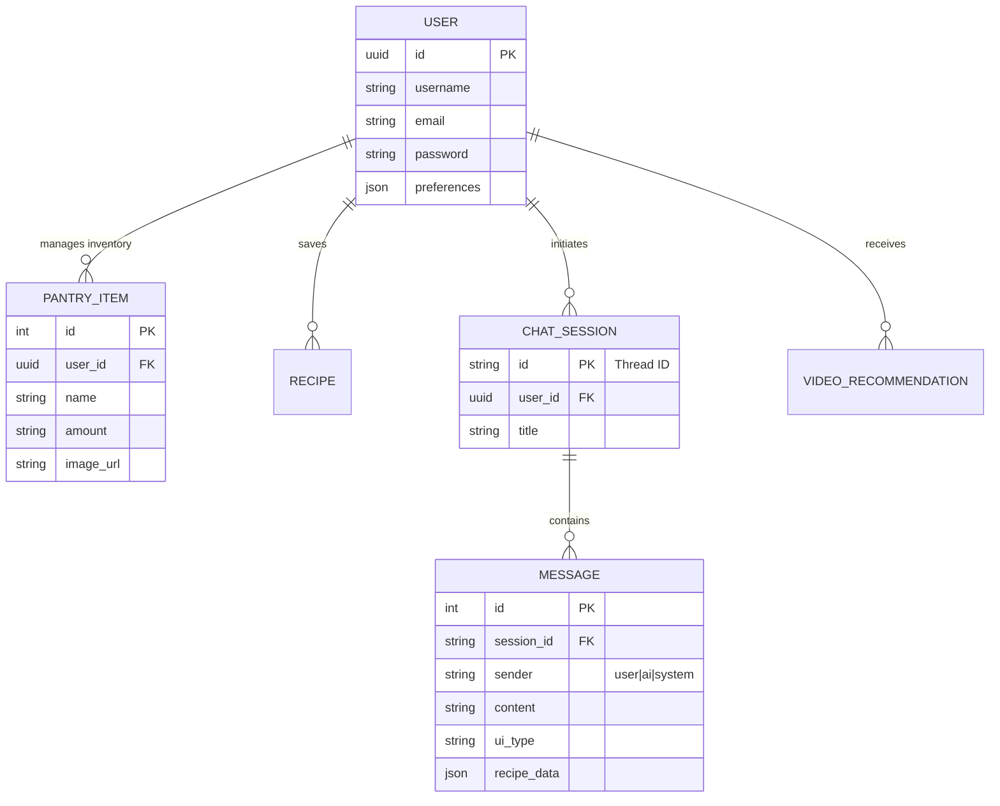

# PlateIt Backend 🐍

[](https://fastapi.tiangolo.com/)
[](https://www.postgresql.org/)
[](https://supabase.com/)

The **PlateIt Backend** is a high-performance, asynchronous FastAPI service that serves as the "Central Nervous System" of the application. It handles identity management, real-time data persistence, and coordinates the complex LangGraph workflows that drive our AI-native features.

---

## 🏗️ Architecture & Data Modeling

The system is built on a scalable relational foundation hosted on **Supabase**. Our schema is designed to support deep context for the Chef Agent, tracking not just recipes but the user's physical inventory and session history.

### Strategic Entity Logic (ERD)



---

## 🔌 Core API Endpoints

### 🔐 Authentication & Identity
- `POST /signup`: Secure user registration.
- `POST /signin`: JWT-based authentication.
- `GET /users/profile/{user_id}`: Comprehensive profile retrieval.
- `POST /users/preferences`: Dynamic update of culinary tastes.
- `GET /users/stats/{user_id}`: Real-time analytics (recipes cooked, active streaks).

### 🥫 Intelligent Pantry
- `POST /pantry/scan_image`: Gemini 3 powered visual ingredient detection.
- `POST /pantry/add`: Manual entry with auto-categorization.
- `GET /pantry/{user_id}`: Full synchronized inventory.
- `DELETE /pantry/{item_id}`: Inventory decrement/removal.

### 🧠 AI Orchestration & Recipes
- `POST /chat`: Multi-agent conversation via Gemini 3 + LangGraph.
- `GET /chat/sessions/{user_id}`: Persistent thread management.
- `POST /extract_recipe`: End-to-end video/URL to structured JSON.
- `POST /extract_recipe_image`: OCR & Vision parsing of physical recipe text.
- `POST /recipes/identify_dish`: Visual dish identification & recipe generation.
- `GET /recipes/findByIngredients`: Proactive recipe discovery based on available stock.

---

## 🛠️ Infrastructure Setup

1. **Environment Preparation**:
   ```bash
   pip install -r Agent/requirements.txt
   ```

2. **Configuration**:
   Ensure your `.env` in the `Agent/` directory contains:
   ```env
   DATABASE_URL=your_supabase_connection_string
   GEMINI_API_KEY=your_google_ai_studio_key
   OPEN_API_KEY=your_openai_key
   ```

3. **Deployment**:
   ```bash
   # Execute from the root or /BackEnd/Agent
   uvicorn agent_server:app --host 0.0.0.0 --port 8080
   ```
